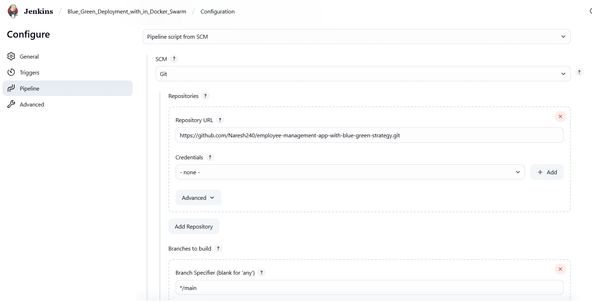
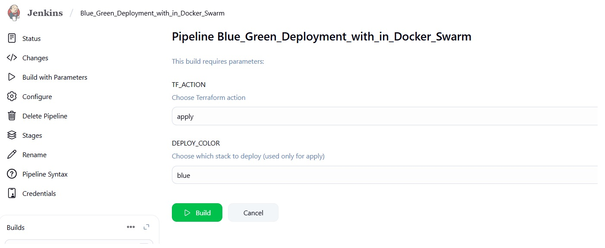
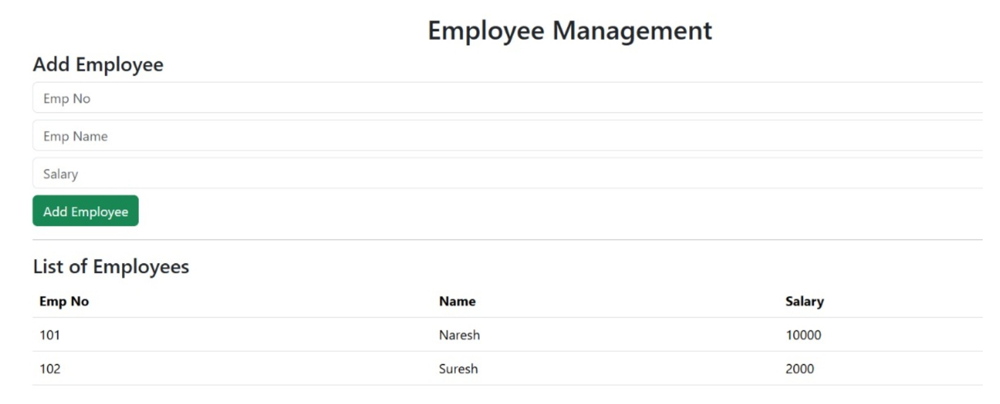
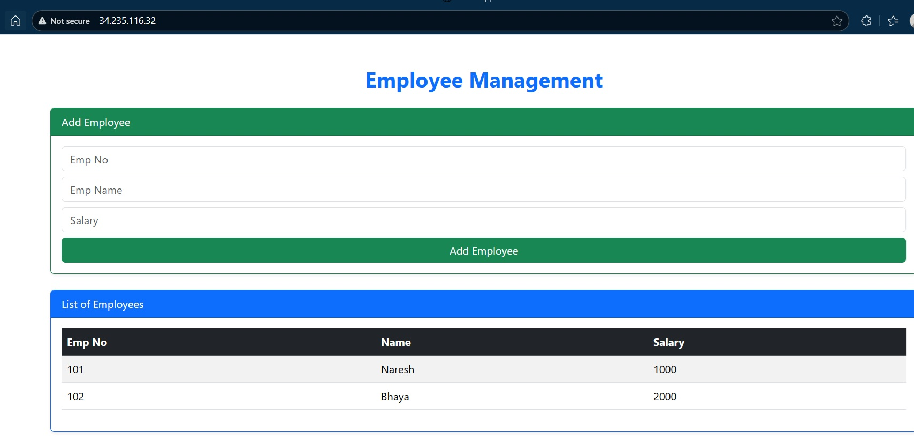

# Employee Management Application with Blue Green Strategy

## Pre-Requisites:

- Jenkins Setup on Amazon Linux

```bash
# Download repo file for jenkins
wget -O /etc/yum.repos.d/jenkins.repo https://pkg.jenkins.io/redhat-stable/jenkins.repo
rpm --import https://pkg.jenkins.io/redhat-stable/jenkins.io-2023.key

# pre-requisite for Jenkins
yum install fontconfig java-21-amazon-corretto -y

# Install jenkins on Amazon Linux
yum install jenkins -y
service jenkins start
```

- Install Git

```bash
yum install git -y
```

- Install Maven

```bash
yum install maven -y
```

- Install Docker

```bash
yum install docker -y
usermod -aG docker jenkins
service docker start
```

- Install terraform on amazon linux

```bash
sudo yum install -y yum-utils shadow-utils
sudo yum-config-manager --add-repo https://rpm.releases.hashicorp.com/AmazonLinux/hashicorp.repo
sudo yum install terraform -y
```

- Create private and public keys for jenkins user under jenkins server

```bash
# Switch to jenkins user
su -s /bin/bash jenkins

# Create keys
ssh-keygen

# /var/lib/jenkins/.ssh/id_rsa          --> Public key
# /var/lib/jenkins/.ssh/id_rsa.pub      --> Private key
# Jenkins_Home: /var/lib/jenkins/
```

- Plugins to be add in jenkins

```bash
# path --> manage jenkins --> plugins --> Available plugins
AWS Credentials
SSH Agent
```

- Create Credentials in jenkins

```bash
# Docker Credentials with the name of ```docker_creds```
# AWS Credentails with the name of ```aws_creds```
# Private key to connect docker swarm to deploy application with the keyname ```swarm_key```, here we need to copy prikey from path ```/var/lib/jenkins/.ssh/id_rsa```
```

## Jenkins job creation


## Run Jenkins job



## Blue deployment output



## Green deployment output

